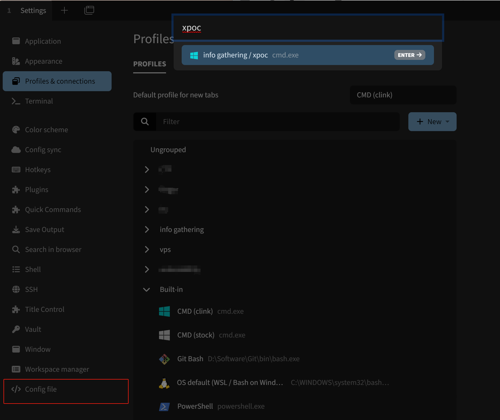

# Awesome-Redteam

**【免责声明】本项目所涉及的技术、思路和工具仅供学习，任何人不得将其用于非法用途和盈利，不得将其用于非授权渗透测试，否则后果自行承担，与本项目无关。使用本项目前请先阅读 [法律法规](https://github.com/Threekiii/Awesome-Laws)。**

## _Roadmap_


## 目录 _Contents_

- [项目导航 _Project Navigation_](#%E9%A1%B9%E7%9B%AE%E5%AF%BC%E8%88%AA-project-navigation)
	- [速查文档 _CheatSheets_](#%E9%80%9F%E6%9F%A5%E6%96%87%E6%A1%A3-cheatsheets)
	- [一些代码 _Scripts_](#%E4%B8%80%E4%BA%9B%E4%BB%A3%E7%A0%81-scripts)
	- [攻防知识 _Tips_](#%E6%94%BB%E9%98%B2%E7%9F%A5%E8%AF%86-tips)
- [开源导航 _Open-Source Navigation_](#%E5%BC%80%E6%BA%90%E5%AF%BC%E8%88%AA-open-source-navigation)
	- [编解码/加解密 _Cryptography_](#%E7%BC%96%E8%A7%A3%E7%A0%81%E5%8A%A0%E8%A7%A3%E5%AF%86-cryptography)
	- [威胁情报 _Threat Intelligence_](#%E5%A8%81%E8%83%81%E6%83%85%E6%8A%A5-threat-intelligence)
	- [网络空间测绘 _Cyberspace Search Engine_](#%E7%BD%91%E7%BB%9C%E7%A9%BA%E9%97%B4%E6%B5%8B%E7%BB%98-cyberspace-search-engine)
	- [开源情报 _Open-Source Intelligence_](#%E5%BC%80%E6%BA%90%E6%83%85%E6%8A%A5-open-source-intelligence)
	- [攻防相关 _Offensive Security_](#%E6%94%BB%E9%98%B2%E7%9B%B8%E5%85%B3-offensive-security)
	- [漏洞相关 _Vulnerabilities_](#%E6%BC%8F%E6%B4%9E%E7%9B%B8%E5%85%B3-vulnerabilities)
	- [社区/知识库 _Open-Source Resources_](#%E7%A4%BE%E5%8C%BA%E7%9F%A5%E8%AF%86%E5%BA%93-open-source-resources)
	- [工具集 _Open-Source Toolkit_](#%E5%B7%A5%E5%85%B7%E9%9B%86-open-source-toolkit)
- [信息收集 _Reconnaissance_](#%E4%BF%A1%E6%81%AF%E6%94%B6%E9%9B%86-reconnaissance)
	- [综合工具 _Nice Tools_](#%E7%BB%BC%E5%90%88%E5%B7%A5%E5%85%B7-nice-tools)
	- [IP/域名/子域名 _IP/Domain/Subdomain_](#ip%E5%9F%9F%E5%90%8D%E5%AD%90%E5%9F%9F%E5%90%8D-ipdomainsubdomain)
	- [指纹识别 _Fingerprint_](#%E6%8C%87%E7%BA%B9%E8%AF%86%E5%88%AB-fingerprint)
	- [扫描/爆破 _Brute Force_](#%E6%89%AB%E6%8F%8F%E7%88%86%E7%A0%B4-brute-force)
		- [扫描/爆破工具 _Brute Force Tools_](#%E6%89%AB%E6%8F%8F%E7%88%86%E7%A0%B4%E5%B7%A5%E5%85%B7-brute-force-tools)
		- [扫描/爆破字典 _Brute Force Dictionaries_](#%E6%89%AB%E6%8F%8F%E7%88%86%E7%A0%B4%E5%AD%97%E5%85%B8-brute-force-dictionaries)
		- [字典生成 _Generate a Custom Dictionary_](#%E5%AD%97%E5%85%B8%E7%94%9F%E6%88%90-generate-a-custom-dictionary)
		- [默认口令查询 _Default Credentials_](#%E9%BB%98%E8%AE%A4%E5%8F%A3%E4%BB%A4%E6%9F%A5%E8%AF%A2-default-credentials)
	- [社会工程学 _Social Engineering_](#%E7%A4%BE%E4%BC%9A%E5%B7%A5%E7%A8%8B%E5%AD%A6-social%C2%A0engineering)
		- [凭据泄露 _Leaked Credentials_](#%E5%87%AD%E6%8D%AE%E6%B3%84%E9%9C%B2-leaked-credentials)
		- [邮箱 _Email_](#%E9%82%AE%E7%AE%B1-email)
		- [钓鱼 _Phishing_](#%E9%92%93%E9%B1%BC-phishing)
	- [移动端 _Mobile_](#%E7%A7%BB%E5%8A%A8%E7%AB%AF-mobile)
- [漏洞研究 _Vulnerability Research_](#%E6%BC%8F%E6%B4%9E%E7%A0%94%E7%A9%B6-vulnerability-research)
	- [漏洞复现 _Reproduce_](#%E6%BC%8F%E6%B4%9E%E5%A4%8D%E7%8E%B0-reproduce)
	- [PoC _Proof of Concept_](#poc-proof-of-concept)
- [漏洞利用 _Exploits_](#%E6%BC%8F%E6%B4%9E%E5%88%A9%E7%94%A8-exploits)
	- [综合工具 _Nice Tools_](#%E7%BB%BC%E5%90%88%E5%B7%A5%E5%85%B7-nice-tools)
	- [反序列化 _Deserialization_](#%E5%8F%8D%E5%BA%8F%E5%88%97%E5%8C%96-deserialization)
	- [代码审计 _Code Audit_](#%E4%BB%A3%E7%A0%81%E5%AE%A1%E8%AE%A1-code-audit)
	- [数据库 _Database_](#%E6%95%B0%E6%8D%AE%E5%BA%93-database)
	- [信息泄露 _Information Disclosure_](#%E4%BF%A1%E6%81%AF%E6%B3%84%E9%9C%B2-information-disclosure)
	- [_CMS/OA_](#cmsoa)
	- [中间件/应用层 _Middleware/Application_](#%E4%B8%AD%E9%97%B4%E4%BB%B6%E5%BA%94%E7%94%A8%E5%B1%82-middlewareapplication)
- [渗透测试 _Penertation Testing_](#%E6%B8%97%E9%80%8F%E6%B5%8B%E8%AF%95-penertation-testing)
	- [综合工具 _Nice Tools_](#%E7%BB%BC%E5%90%88%E5%B7%A5%E5%85%B7-nice-tools)
	- [_Web_](#web)
	- [_DNSLog_](#dnslog)
	- [_Payload and Bypass_](#payload-and-bypass)
- [内网渗透 _Red Teaming_](#%E5%86%85%E7%BD%91%E6%B8%97%E9%80%8F-red-teaming)
	- [凭证获取 _Credential Access_](#%E5%87%AD%E8%AF%81%E8%8E%B7%E5%8F%96-credential-access)
	- [后渗透 _Post Exploitation_](#%E5%90%8E%E6%B8%97%E9%80%8F-post-exploitation)
	- [权限提升 _Privilege Escalation_](#%E6%9D%83%E9%99%90%E6%8F%90%E5%8D%87-privilege-escalation)
	- [权限维持 _Persistence_](#%E6%9D%83%E9%99%90%E7%BB%B4%E6%8C%81-persistence)
	- [免杀项目 _Defense Evasion_](#%E5%85%8D%E6%9D%80%E9%A1%B9%E7%9B%AE-defense-evasion)
	- [内网穿透 _Proxy_](#%E5%86%85%E7%BD%91%E7%A9%BF%E9%80%8F-proxy)
	- [辅助工具 _Auxiliary Tools_](#%E8%BE%85%E5%8A%A9%E5%B7%A5%E5%85%B7-auxiliary-tools)
- [域渗透 _Active Directory / Kerberos_](#%E5%9F%9F%E6%B8%97%E9%80%8F-active-directory--kerberos)
	- [开源资源 _Resources_](#%E5%BC%80%E6%BA%90%E8%B5%84%E6%BA%90-resources)
	- [域内信息收集 Collection and Discovery](#%E5%9F%9F%E5%86%85%E4%BF%A1%E6%81%AF%E6%94%B6%E9%9B%86-collection-and-discovery)
	- [域内已知漏洞 _Known Vulnerabilities_](#%E5%9F%9F%E5%86%85%E5%B7%B2%E7%9F%A5%E6%BC%8F%E6%B4%9E-known-vulnerabilities)
	- [域内渗透方式 Methodology](#%E5%9F%9F%E5%86%85%E6%B8%97%E9%80%8F%E6%96%B9%E5%BC%8F-methodology)
	- [ADCS _Active Directory Certificate Services_](#adcs-active-directory-certificate-services)
- [安全防护 _Defensive Security_](#%E5%AE%89%E5%85%A8%E9%98%B2%E6%8A%A4-defensive-security)
	- [内存马查杀 _Memshell Dectect_](#%E5%86%85%E5%AD%98%E9%A9%AC%E6%9F%A5%E6%9D%80-memshell-dectect)
	- [Webshell查杀 _Webshell Dectect_](#webshell%E6%9F%A5%E6%9D%80-webshell-dectect)
	- [攻击研判 _Blue Teaming_](#%E6%94%BB%E5%87%BB%E7%A0%94%E5%88%A4-blue-teaming)
	- [基线加固 _Enforcement_](#%E5%9F%BA%E7%BA%BF%E5%8A%A0%E5%9B%BA-enforcement)
	- [勒索病毒 _Ransomware_](#%E5%8B%92%E7%B4%A2%E7%97%85%E6%AF%92-ransomware)
	- [开源蜜罐 _Open-Source Honeypot_](#%E5%BC%80%E6%BA%90%E8%9C%9C%E7%BD%90-open-source-honeypot)
- [云安全 _Cloud Security_](#%E4%BA%91%E5%AE%89%E5%85%A8-cloud-security)
	- [开源资源 _Resources_](#%E5%BC%80%E6%BA%90%E8%B5%84%E6%BA%90-resources)
	- [云安全矩阵 _Cloud Matrices_](#%E4%BA%91%E5%AE%89%E5%85%A8%E7%9F%A9%E9%98%B5-cloud-matrices)
	- [_AK/SK_](#aksk)
	- [_Docker_](#docker)
	- [_Kubernetes_](#kubernetes)
- [移动端安全 _Mobile Security_](#%E7%A7%BB%E5%8A%A8%E7%AB%AF%E5%AE%89%E5%85%A8-mobile-security)
	- [小程序 _Mini Program_](#%E5%B0%8F%E7%A8%8B%E5%BA%8F-mini-program)
	- [_APK_](#apk)
	- [_SessionKey_](#sessionkey)
- [逆向工程 _Reverse engineering_](#%E9%80%86%E5%90%91%E5%B7%A5%E7%A8%8B-reverse-engineering)
- [提高生产力的辅助工具](#%E6%8F%90%E9%AB%98%E7%94%9F%E4%BA%A7%E5%8A%9B%E7%9A%84%E8%BE%85%E5%8A%A9%E5%B7%A5%E5%85%B7)
	- [_Shell_](#shell)
	- [_Chrome Extensions_](#chrome-extensions)
	- [_Infrastructure_](#infrastructure)
- [提高生产力的使用姿势](#%E6%8F%90%E9%AB%98%E7%94%9F%E4%BA%A7%E5%8A%9B%E7%9A%84%E4%BD%BF%E7%94%A8%E5%A7%BF%E5%8A%BF)
	- [如何通过.bat使用alias](#%E5%A6%82%E4%BD%95%E9%80%9A%E8%BF%87bat%E4%BD%BF%E7%94%A8alias)
	- [如何通过.bat激活conda并运行py](#%E5%A6%82%E4%BD%95%E9%80%9A%E8%BF%87bat%E6%BF%80%E6%B4%BBconda%E5%B9%B6%E8%BF%90%E8%A1%8Cpy)
	- [如何配合tabby实现高效操作](#%E5%A6%82%E4%BD%95%E9%85%8D%E5%90%88tabby%E5%AE%9E%E7%8E%B0%E9%AB%98%E6%95%88%E6%93%8D%E4%BD%9C)
	- [如何解决cmd中文乱码](#%E5%A6%82%E4%BD%95%E8%A7%A3%E5%86%B3cmd%E4%B8%AD%E6%96%87%E4%B9%B1%E7%A0%81)

## 项目导航 _Project Navigation_

### 速查文档 _CheatSheets_

戳这里 [Click Here](https://github.com/Threekiii/Awesome-Redteam/blob/master/cheatsheets/)

```
DefaultCreds-Cheat-Sheet.csv
HuaweiPassword-Cheat-Sheet .csv
WeakPassword-Cheat-Sheet.csv
安全厂商及官网链接速查.txt
```

### 一些代码 _Scripts_

戳这里 [Click Here](https://github.com/Threekiii/Awesome-Redteam/blob/master/scripts/)

```
ShellcodeWrapper: Shellcode加密
AntivirusScanner: 杀软进程检测脚本
runtime-exec-payloads.html: java.lang.Runtime.exec() Payloads生成 
Ascii2Char: ASCII码和字符互相转换脚本 修改webshell文件名密码 
Weakpass_Generator: 在线弱密码生成工具 汉化版
Godzilla_Decryptor: 哥斯拉流量解密
Behinder4_Key_Bruteforce: 冰蝎4密钥爆破
Flask_Session_Decryptor: Flask session注入解密
```

### 攻防知识 _Tips_

戳这里 [Click Here](https://github.com/Threekiii/Awesome-Redteam/blob/master/tips/)

```
信息收集-敏感信息收集
内网渗透-免杀
内网渗透-隐藏
内网渗透-Pentesting AD Mindmap
安全架构-网络攻击与防御图谱
平台搭建-DNS Log
流量分析-CobaltStrike
流量分析-Webshell
社会工程学-钓鱼邮件主题汇总
逆向分析-微信小程序反编译
```

## 开源导航 _Open-Source Navigation_

### 编解码/加解密 _Cryptography_

- Online:
	- http://www.ip33.com/
	- https://evilcos.me/lab/xssee/
	- http://www.metools.info/
	- https://www.107000.com/
	- https://github.com/wangyiwy/oktools
	- http://www.hiencode.com/
	- http://www.atoolbox.net/
	- https://www.sojson.com/
	- https://the-x.cn/
- Offline:
	- https://github.com/Ciphey/Ciphey
	- https://github.com/gchq/CyberChef
	- http://1o1o.xyz/bo_ctfcode.html
	- https://github.com/guyoung/CaptfEncoder
- MD5:
	- https://www.cmd5.org/
	- https://www.somd5.com/
	- https://www.onlinehashcrack.com/
	- https://crackstation.net/
	- https://crack.sh/
	- https://passwordrecovery.io/
	- https://md5decrypt.net/en/Sha256/
	- https://hashes.com/en/decrypt/hash
- RSA:
	- https://www.ssleye.com/ssltool/
	- https://www.lddgo.net/en/encrypt/rsa work with .pem
- Encode/Decode:
	- GB2312: http://code.mcdvisa.com/
	- Unicode: https://www.compart.com/en/unicode/
	- UUencode: http://web.chacuo.net/charsetuuencode
	- Escape/Unescape: https://tool.chinaz.com/tools/escape.aspx
	- HTML实体编码: https://zh.rakko.tools/tools/21/

### 威胁情报 _Threat Intelligence_

- Virustotal: https://www.virustotal.com/
- 腾讯哈勃分析系统: https://habo.qq.com/tool/index
- 微步在线威胁情报: https://x.threatbook.cn/
- 奇安信威胁情报: https://ti.qianxin.com/
- 360威胁情报: https://ti.360.net/
- 网络安全威胁信息共享平台: https://share.anva.org.cn/web/publicity/listPhishing
- 安恒威胁情报: https://ti.dbappsecurity.com.cn/
- 火线安全平台: https://www.huoxian.cn
- 知道创宇黑客新闻流: https://hackernews.cc/
- Hacking8安全信息流: https://i.hacking8.com/
- SecWiki安全信息流: https://www.sec-wiki.com/

### 网络空间测绘 _Cyberspace Search Engine_

- Fofa: https://fofa.info/
- Shodan: https://www.shodan.io/
- ZoomEye: https://www.zoomeye.org/
- 鹰图: https://hunter.qianxin.com/
- 谛听: https://www.ditecting.com/
- Quake: https://quake.360.cn/quake/
- Wayback Machine: 网页历史缓存 https://archive.org/web
- VisualPing: 网页变动监测 https://visualping.io/
- Dark Web Exposure: https://immuniweb.com/radar/
- SG TCP/IP 端口数据库: https://www.speedguide.net/ports.php
- Google Hacking Database:
	- https://www.exploit-db.com/google-hacking-database
	- https://github.com/cipher387/Dorks-collections-list
	- https://cxsecurity.com/dorks/
- Google Hacking Online:
	- https://dorks.faisalahmed.me/
	- https://pentest-tools.com/information-gathering/google-hacking
	- http://advangle.com/
	- https://0iq.me/gip/
- Google Hacking Cli:
	- https://github.com/obheda12/GitDorker
	- https://github.com/six2dez/dorks_hunter
- Github Dork:
	- https://github.com/search/advanced
	- https://github.com/obheda12/GitDorker
	- https://github.com/damit5/gitdorks_go

### 开源情报 _Open-Source Intelligence_

- OSINT Resource List: https://start.me/p/rx6Qj8/nixintel-s-osint-resource-list
- OSINT Framework: https://osintframework.com/
- OSINT Handbook: https://i-intelligence.eu/uploads/public-documents/OSINT_Handbook_2020.pdf
- Public APIs:
	- https://www.postman.com/explore/
	- https://rapidapi.com/
- Discover secret API keys: https://serene-agnesi-57a014.netlify.app/
- Source code Search Engine:
	- https://publicwww.com/
	- https://searchcode.com/
- RSS Feeds:
	- https://github.com/zer0yu/CyberSecurityRSS
	- https://github.com/zhengjim/Chinese-Security-RSS
	- https://wechat2rss.xlab.app/posts/list/

### 攻防相关 _Offensive Security_

- Red Teaming and Offensive Security:
	- https://www.ired.team/
	- https://www.thehacker.recipes/
	- https://ppn.snovvcrash.rocks/
	- https://book.hacktricks.xyz/
	- https://blog.harmj0y.net/
	- https://hausec.com/domain-penetration-testing/
	- https://dirkjanm.io/
	- https://casvancooten.com/
	- https://evasions.checkpoint.com/
	- https://redteam.guide/docs/definitions
- Blue Teaming and Defensive Security:
	- https://github.com/Purp1eW0lf/Blue-Team-Notes
- OPSEC:
	- https://github.com/WesleyWong420/OPSEC-Tradecraft

### 漏洞相关 _Vulnerabilities_

- 国内信息披露平台:
	- 国家信息安全漏洞库: https://www.cnnvd.org.cn/
	- 国家互联网应急中心: https://www.cert.org.cn/
	- 360网络安全响应中心: https://cert.360.cn/
	- 知道创宇漏洞库: https://www.seebug.org/
	- 长亭漏洞库: https://stack.chaitin.com/vuldb/
	- 阿里云漏洞库: https://avd.aliyun.com/high-risk/list
	- PeiQi漏洞库: https://peiqi.wgpsec.org/
- 国外信息披露平台:
	- https://www.hackerone.com/
	- https://cve.mitre.org/
	- https://nvd.nist.gov/
	- https://www.rapid7.com/db/
	- https://packetstormsecurity.com/files/tags/exploit
	- https://github.com/trickest/cve
- Exploits 搜索引擎:
	- https://sploitus.com/
	- https://www.exploit-db.com/ kali中可以配合命令 `searchsploit <keywords>` 使用

### 社区/知识库 _Open-Source Resources_

- 先知社区: https://xz.aliyun.com/
- Infocon: https://infocon.org/
- ffffffff0x 团队安全知识框架: https://github.com/ffffffff0x/1earn
- 狼组公开知识库: https://wiki.wgpsec.org/
- Mitre ATT&CK:
	- matrices: https://attack.mitre.org/matrices/enterprise
	- techniques: http://attack.mitre.org/techniques/enterprise/
- Hacking articles: https://www.hackingarticles.in/
- PostSwigger blog: https://portswigger.net/blog
- InGuardians Labs blog: https://www.inguardians.com/
- Pentest Workflow: https://pentest.mxhx.org/
- Pentest cheatsheet: https://pentestbook.six2dez.com/
- Programming/Toolkit/Command/OS/Shortcuts Cheatsheets:
	- https://cheatsheets.zip/

**If you want to improve your English language skills:**

- https://www.grammarly.com/grammar-check
- https://ludwig.guru/

### 工具集 _Open-Source Toolkit_

- Nice Tools:
	- https://forum.ywhack.com/bountytips.php?tools
	- https://github.com/knownsec/404StarLink
	- https://pentest-tools.com/
- Online:
	- 反弹 Shell: https://forum.ywhack.com/reverse-shell/
	- 正则表达式: https://c.runoob.com/front-end/854/
	- 代码格式标准化: http://web.chacuo.net/formatsh
	- 接收验证码: https://www.supercloudsms.com/en/
	- 临时邮箱: http://24mail.chacuo.net/
	- 短链接生成: https://a.f8x.io/
- Offline:
	- 反弹 Shell: https://github.com/0dayCTF/reverse-shell-generator
	- 文件下载: https://github.com/r0eXpeR/File-Download-Generator

## 信息收集 _Reconnaissance_

### 综合工具 _Nice Tools_

- AlliN: https://github.com/P1-Team/AlliN
- Kunyu: https://github.com/knownsec/Kunyu
- OneForAll: https://github.com/shmilylty/OneForAll
- ShuiZe: https://github.com/0x727/ShuiZe_0x727
- FofaX: https://github.com/xiecat/fofax
- Fofa Viewer: https://github.com/wgpsec/fofa_viewer
- Fofa GUI: https://github.com/bewhale/FOFA_GUI
- kscan: https://github.com/lcvvvv/kscan
- fscan: https://github.com/shadow1ng/fscan
- ENScan_GO: https://github.com/wgpsec/ENScan_GO
- Ladon: https://github.com/k8gege/Ladon
- Amass: https://github.com/OWASP/Amass
- hping3: 端口扫描 高速 发包量少 结果准确无蜜罐 https://github.com/antirez/hping

### IP/域名/子域名 _IP/Domain/Subdomain_

- IP信息收集:
	- https://www.ipuu.net/
	- https://site.ip138.com/
	- https://securitytrails.com/
	- https://myip.ms/
	- http://ipwhois.cnnic.net.cn
- 多个地点Ping服务器:
	- https://ping.chinaz.com/
	- https://www.host-tracker.com/
	- https://www.webpagetest.org/
	- https://dnscheck.pingdom.com/
- IP反查域名:
	- https://site.ip138.com/
	- https://x.threatbook.cn/
	- https://www.virustotal.com/
- Whois信息收集:
	- https://whois.chinaz.com/
	- https://whois.aliyun.com/
	- https://who.is/
	- https://www.whoxy.com/
- DNS信息收集:
	- https://hackertarget.com/find-dns-host-records
	- https://dnsdumpster.com
	- https://dnsdb.io/zh-cn
	- https://centralops.net/co/
	- https://viewdns.info/
	- https://dnsdumpster.com/
	- https://rapiddns.io/
- ASN信息收集:
	- https://wq.apnic.net/
	- https://bgp.he.net/
	- https://bgpview.io/
- TLS证书查询:
	- https://censys.io
	- https://crt.sh
	- https://developers.facebook.com/tools/ct

### 指纹识别 _Fingerprint_

- Fingerprint Collection:
	- https://github.com/r0eXpeR/fingerprint
- Fingerprint Reconnaissance:
	- https://github.com/EASY233/Finger
	- https://github.com/EdgeSecurityTeam/EHole
	- https://github.com/0x727/ObserverWard
	- https://github.com/TideSec/TideFinger
	- https://github.com/zhzyker/dismap
	- https://www.webshell.cc/4697.html
	- http://www.yunsee.cn/ online
	- https://github.com/AliasIO/Wappalyzer chrome extension
- Waf Checks:
	- https://github.com/stamparm/identYwaf
	- https://github.com/EnableSecurity/wafw00f
	- https://github.com/MISP/misp-warninglists

### 扫描/爆破 _Brute Force_

#### 扫描/爆破工具 _Brute Force Tools_

- Subdomain:
	- https://github.com/projectdiscovery/subfinder
	- https://github.com/knownsec/ksubdomain
- URLs:
	- https://github.com/pingc0y/URLFinder
	- https://github.com/s0md3v/Arjun
	- https://github.com/OJ/gobuster
	- https://github.com/jaeles-project/gospider
- Directory:
	- https://github.com/maurosoria/dirsearch
	- https://github.com/H4ckForJob/dirmap
	- https://github.com/ffuf/ffuf
- Password:
	- https://github.com/vanhauser-thc/thc-hydra
	- https://github.com/openwall/john
	- https://github.com/hashcat/hashcat
	- https://github.com/galkan/crowbar supports sshkey and openvpn
- Json web token (JWT):
	- https://github.com/ticarpi/jwt_tool
	- https://github.com/brendan-rius/c-jwt-cracker
	- https://github.com/wallarm/jwt-secrets/blob/master/jwt.secrets.list

#### 扫描/爆破字典 _Brute Force Dictionaries_

- Wordlists for all:
	- https://github.com/danielmiessler/SecLists 46.4k star
	- https://github.com/SexyBeast233/SecDictionary + ffuf
	- https://github.com/insightglacier/Dictionary-Of-Pentesting
	- https://github.com/TheKingOfDuck/fuzzDicts
	- https://github.com/gh0stkey/Web-Fuzzing-Box
	- https://github.com/ppbibo/PentesterSpecialDict
	- https://github.com/Bo0oM/fuzz.txt
	- https://github.com/assetnote/wordlists
- Web fuzz wordlists:
	- https://github.com/lutfumertceylan/top25-parameter
- Others (not frequently used):
	- https://github.com/danielmiessler/SecLists/tree/master/Discovery/Web-Content
	- https://github.com/assetnote/commonspeak2-wordlists/tree/master/wordswithext
	- https://github.com/random-robbie/bruteforce-lists
	- https://github.com/google/fuzzing/tree/master/dictionaries
	- https://github.com/six2dez/OneListForAll

#### 字典生成 _Generate a Custom Dictionary_

- Online:
	- Generate wordlists: https://weakpass.com/generate
	- Generate subdomains and wordlists: https://weakpass.com/generate/domains
	- 汉字转拼音: https://www.aies.cn/pinyin.htm
	- 密码猜解: https://www.hacked.com.cn/pass.html
- Private Deployment:
	- Generate wordlists(offline): https://github.com/zzzteph/weakpass
	- Generate subdomains and wordlists(offline): https://github.com/zzzteph/probable_subdomains
- Offline:
	- pydictor: 一个强大实用的黑客暴力破解字典建立工具 https://github.com/LandGrey/pydictor/
	- crunch:
		- Kali/Linux: https://sourceforge.net/projects/crunch-wordlist
		- Windows: https://github.com/shadwork/Windows-Crunch

#### 默认口令查询 _Default Credentials_

- Default Credentials Cheat Sheet: 3468个默认密码 https://github.com/ihebski/DefaultCreds-cheat-sheet
- datarecovery: 在线默认口令查询 https://datarecovery.com/rd/default-passwords/
- cirt.net: 在线默认口令查询 https://cirt.net/passwords
- 在线路由器密码查询:
  - https://www.routerpasswords.com/
  - https://portforward.com/router-password/
  - https://www.cleancss.com/router-default/
  - https://www.toolmao.com/baiduapp/routerpwd/
  - https://datarecovery.com/rd/default-passwords/

### 社会工程学 _Social Engineering_

#### 凭据泄露 _Leaked Credentials_

- https://haveibeenpwned.com
- https://breachdirectory.org/

#### 邮箱 _Email_

- Snov.io: https://app.snov.io
- Phonebook: also works on subdomains and urls https://phonebook.cz
- Skymem: https://www.skymem.info
- Hunter: https://hunter.io
- email-format: https://www.email-format.com/i/search/
- 搜邮箱: https://souyouxiang.com/find-contact/
- theHarvester: also works on subdomains https://github.com/laramies/theHarvester
- Verify emails: https://tools.emailhippo.com/
- Accounts registered by email: https://emailrep.io/

#### 钓鱼 _Phishing_

- gophish: 钓鱼邮件 https://github.com/gophish/gophish
- SpoofWeb: 一键部署 https 钓鱼网站 https://github.com/5icorgi/SpoofWeb

### 移动端 _Mobile_

- 小蓝本: https://www.xiaolanben.com/
- 七麦数据: https://www.qimai.cn/

## 漏洞研究 _Vulnerability Research_

### 漏洞复现 _Reproduce_

- Web:
	- Sqli-labs: https://github.com/Audi-1/sqli-labs
	- Upload-labs: https://github.com/c0ny1/upload-labs
	- Xss-labs: https://github.com/do0dl3/xss-labs
	- DVWA: https://github.com/digininja/DVWA
	- WebGoat: https://github.com/WebGoat/WebGoat
- Comprehensive:
	- Vulhub: https://vulhub.org/
	- ichunqiu: https://yunjing.ichunqiu.com/
	- HackTheBox: https://www.hackthebox.com/
	- OWASP Top10: https://owasp.org/www-project-juice-shop/
	- Vulstudy: 17 platform based on docker https://github.com/c0ny1/vulstudy
	- Vulfocus: https://github.com/fofapro/vulfocus
- IoT:
	- IoT-vulhub: https://github.com/firmianay/IoT-vulhub
- Cloud:
	- Metarget: https://github.com/Metarget/metarget
	- Attack Defense: https://attackdefense.pentesteracademy.com/listing?labtype=cloud-services&subtype=cloud-services-amazon-s3
	- AWSGoat: https://github.com/ine-labs/AWSGoat
	- TerraformGoat: https://github.com/HuoCorp/TerraformGoat
	- Kubernetes Goat: https://github.com/madhuakula/kubernetes-goat
	- CloudGoat: https://github.com/RhinoSecurityLabs/cloudgoat

### PoC _Proof of Concept_

> Be careful Malware，POC 库最新的 CVE 可能存在投毒风险。

- PoC 库:
	- POChouse: https://github.com/DawnFlame/POChouse
	- Some-PoC-oR-ExP: 各种漏洞PoC、ExP的收集或编写 https://github.com/coffeehb/Some-PoC-oR-ExP
	- Library-POC: 基于Pocsuite3、goby编写的漏洞poc&exp存档 https://github.com/luck-ying/Library-POC
	- Penetration_Testing_POC: https://github.com/Mr-xn/Penetration_Testing_POC
	- PoC-in-GitHub: https://github.com/nomi-sec/PoC-in-GitHub
	- 0day: https://github.com/helloexp/0day
- PoC 编写:
	- POC 辅助生成: 在线 https://poc.xray.cool/
	- POC 辅助生成: 本地 https://github.com/zeoxisca/gamma-gui

## 漏洞利用 _Exploits_

### 综合工具 _Nice Tools_

- xpoc: 供应链漏洞扫描 https://github.com/chaitin/xpoc
- Xray: 安全评估工具 https://github.com/chaitin/xray
- Super Xray: Xray GUI启动器 https://github.com/4ra1n/super-xray
- Vulmap: 漏洞扫描和验证工具 https://github.com/zhzyker/vulmap
- Artillery: 插件化 JAVA 漏洞扫描器 https://github.com/Weik1/Artillery
- Aazhen-v3.1: JavaFX图形化漏洞扫描工具 https://github.com/zangcc/Aazhen-v3.1

### 反序列化 _Deserialization_

- Java:
	- https://github.com/frohoff/ysoserial
	- https://github.com/mbechler/marshalsec
	- https://github.com/qi4L/JYso
	- https://github.com/welk1n/JNDI-Injection-Exploit
	- https://github.com/WhiteHSBG/JNDIExploit
	- https://github.com/rebeyond/JNDInjector
	- https://github.com/A-D-Team/attackRmi
- php:
	- https://github.com/ambionics/phpggc
- Mysql jdbc:
	- https://github.com/4ra1n/mysql-fake-server
	- https://github.com/dushixiang/evil-mysql-server
	- https://github.com/fnmsd/MySQL_Fake_Server

### 代码审计 _Code Audit_

- tabby: https://github.com/wh1t3p1g/tabby

### 数据库 _Database_

- RedisStudio: Redis 未授权 https://github.com/cinience/RedisStudio
- redis-rogue-server: Redis 未授权 https://github.com/n0b0dyCN/redis-rogue-server
- redis-rce: Redis 未授权 https://github.com/Ridter/redis-rce
- MDUT: Multiple Database Utilization Tools https://github.com/SafeGroceryStore/MDUT
- odat: Oracle RCE https://github.com/quentinhardy/odat

### 信息泄露 _Information Disclosure_

- GitHack: .git泄露利用脚本 https://github.com/lijiejie/GitHack python3 有时无法恢复.git目录，推荐python2版本
- GitHack: .git泄露利用脚本 https://github.com/BugScanTeam/GitHack python2
- dvcs-ripper: .svn、.hg、.cvs泄露利用脚本 https://github.com/kost/dvcs-ripper
- ds_store_exp: .DS_Store 文件泄漏利用脚本 https://github.com/lijiejie/ds_store_exp
- Hawkeye: GitHub 泄露监控系统 https://github.com/0xbug/Hawkeye

### _CMS/OA_

- 通达OA: https://github.com/Fu5r0dah/TongdaScan_go
- MYExploit: https://github.com/achuna33/MYExploit
- Apt_t00ls: https://github.com/White-hua/Apt_t00ls
- OA-EXPTOOL: https://github.com/LittleBear4/OA-EXPTOOL

### 中间件/应用层 _Middleware/Application_

- Druid:
	- DruidCrack: Druid密文解密工具 https://github.com/rabbitmask/DruidCrack
	- druid_sessions: Druid sessions利用工具 https://github.com/yuyan-sec/druid_sessions
- Etcd:
	- etcd: etcdctl https://github.com/etcd-io/etcd
- Fastjson:
	- fastjson-exp: https://github.com/amaz1ngday/fastjson-exp
- Nacos:
	- NacosRce: Nacos Hessian 反序列化 https://github.com/c0olw/NacosRce/
	- nacosleak: 获取nacos中配置文件信息 https://github.com/a1phaboy/nacosleak
	- nacosScan: jwt硬编码、api未授权添加用户、配置读取 https://github.com/Whoopsunix/nacosScan
	- NacosExploitGUI: https://github.com/charonlight/NacosExploitGUI
- Nps:
	- nps-auth-bypass: nps认证绕过利用工具 https://github.com/carr0t2/nps-auth-bypass
- Java:
	- jdwp-shellifier: python2 https://github.com/IOActive/jdwp-shellifier
	- jdwp-shellifier: https://github.com/Lz1y/jdwp-shellifier
- Shiro:
	- Shiro rememberMe 在线解密: https://vulsee.com/tools/shiroDe/shiroDecrypt.html
	- shiro_attack: https://github.com/j1anFen/shiro_attack
	- shiro_rce_tool: https://github.com/wyzxxz/shiro_rce_tool
	- ShiroExploit: https://github.com/feihong-cs/ShiroExploit-Deprecated
	- ShiroExp: https://github.com/safe6Sec/ShiroExp
	- shiro_key: shiro key 收集 目前 1k+ https://github.com/yanm1e/shiro_key
- Struts:
	- Struts2VulsTools: https://github.com/shack2/Struts2VulsTools
- Spring:
	- SpringBoot-Scan: https://github.com/AabyssZG/SpringBoot-Scan
	- Spring_All_Reachable: Spring Cloud Gateway命令执行 CVE-2022-22947、Spring Cloud Function SpEL 远程代码执行 CVE-2022-22963 https://github.com/savior-only/Spring_All_Reachable
	- SpringBootVulExploit: https://github.com/LandGrey/SpringBootVulExploit
	- Spring-cloud-function-SpEL-RCE: CVE-2022-22963 https://github.com/mamba-2021/EXP-POC/tree/main/Spring-cloud-function-SpEL-RCE
	- swagger-exp: Swagger REST API 信息泄露利用工具 https://github.com/lijiejie/swagger-exp
- Heapdump:
	- heapdump_tool: heapdump敏感信息查询工具 https://github.com/wyzxxz/heapdump_tool
	- Memory Analyzer: HeapDump分析工具 https://www.eclipse.org/mat/previousReleases.php
	- JDumpSpider: HeapDump敏感信息提取工具 https://github.com/whwlsfb/JDumpSpider
- Tomcat:
	- CVE-2020-1938: https://github.com/YDHCUI/CNVD-2020-10487-Tomcat-Ajp-lfi
	- ClassHound: https://github.com/LandGrey/ClassHound
- Thinkphp:
	- ThinkphpGUI: https://github.com/Lotus6/ThinkphpGUI
	- thinkphp_gui_tools: https://github.com/bewhale/thinkphp_gui_tools
- Weblogic:
	- WeblogicTool: https://github.com/KimJun1010/WeblogicTool
	- WeblogicScan: https://github.com/dr0op/WeblogicScan
	- WeblogicScan: https://github.com/rabbitmask/WeblogicScan
	- weblogicScanner: https://github.com/0xn0ne/weblogicScanner
	- weblogic-framework: https://github.com/sv3nbeast/weblogic-framework
- WebSocket:
	- wscat: https://github.com/websockets/wscat
- vSphere:
	- VcenterKiller: 针对Vcenter的综合利用工具 https://github.com/Schira4396/VcenterKiller
	- VcenterKit: Vcenter综合渗透利用工具包 https://github.com/W01fh4cker/VcenterKit
- Zookeeper:
	- ZooInspector: ZooKeeper 客户端监控软件 https://issues.apache.org/jira/secure/attachment/12436620/ZooInspector.zip
	- apache-zookeeper: zkCli.sh 客户端命令连接 https://archive.apache.org/dist/zookeeper/zookeeper-3.5.6/

## 渗透测试 _Penertation Testing_

### 综合工具 _Nice Tools_

- Yakit: https://github.com/yaklang/yakit
- Burpsuite: https://portswigger.net/burp
- Burpsuite Extensions:
	- HaE: 高亮标记与信息提取辅助型插件 https://github.com/gh0stkey/HaE
	- Log4j2Scan: Log4j主动扫描插件 https://github.com/whwlsfb/Log4j2Scan
	- RouteVulScan: 检测脆弱路径插件 https://github.com/F6JO/RouteVulScan
	- BurpCrypto: 硬编码快乐渗透插件 https://github.com/whwlsfb/BurpCrypto

### _Web_

- XSS:
	- XSS Chop: https://xsschop.chaitin.cn/demo/
	- XSS/CSRF编码转换: https://evilcos.me/lab/xssor/
	- HTML5 Security Cheatsheet: XSS攻击向量学习/参考 https://html5sec.org/
- Local File Inclusion:
	- https://github.com/hansmach1ne/lfimap
	- https://github.com/mzfr/liffy

### _DNSLog_

- Online:
	- http://ceye.io/
	- http://dnslog.cn/
	- https://dig.pm/
- Alphalog: dns/http/rmi/ldap https://github.com/AlphabugX/Alphalog
- DNS rebinding: https://lock.cmpxchg8b.com/rebinder.html
- DNSLog-GO: 自建私有平台 https://github.com/lanyi1998/DNSlog-GO

### _Payload and Bypass_

- Bypass HTTP 40X errors:
	- https://github.com/yunemse48/403bypasser
	- https://github.com/lobuhi/byp4xx
	- https://github.com/Dheerajmadhukar/4-ZERO-3
	- https://github.com/devploit/nomore403
- PayloadsAllTheThings: https://github.com/swisskyrepo/PayloadsAllTheThings
- java.lang.Runtime.exec() Payload: java Payload在线生成 https://www.bugku.net/runtime-exec-payloads/
- PHP Generic Gadget Chains: PHP反序列化Payload https://github.com/ambionics/phpggc
- PHPFuck: https://github.com/splitline/PHPFuck
- JSFuck: http://www.jsfuck.com/
- Gopherus: SSRF 生成gopher链接 https://github.com/tarunkant/Gopherus python2
- CVE-2021-44228-PoC-log4j-bypass-words: https://github.com/Puliczek/CVE-2021-44228-PoC-log4j-bypass-words

## 内网渗透 _Red Teaming_

### 凭证获取 _Credential Access_

- Credential Dumping:
	- LaZagne: https://github.com/AlessandroZ/LaZagne
	- WirelessKeyView: https://www.nirsoft.net/utils/wireless_key.html
	- Windows credential manager: https://www.nirsoft.net/utils/credentials_file_view.html
	- Pillager: https://github.com/qwqdanchun/Pillager/
	- searchall: https://github.com/Naturehi666/searchall
- Local Enumeration:
	- HackBrowserData: https://github.com/moonD4rk/HackBrowserData
	- BrowserGhost: https://github.com/QAX-A-Team/BrowserGhost
	- chrome: http://www.nirsoft.net/utils/chromepass.html
	- firefox: https://github.com/unode/firefox_decrypt
	- foxmail: https://securityxploded.com/foxmail-password-decryptor.php
	- mobaxterm: https://github.com/HyperSine/how-does-MobaXterm-encrypt-password
	- navicat: https://github.com/Zhuoyuan1/navicat_password_decrypt
	- navicat: https://github.com/HyperSine/how-does-navicat-encrypt-password
	- sunflower: https://github.com/wafinfo/Sunflower_get_Password
	- securreCRT: https://github.com/depau/shcrt
	- xshell:
		- https://github.com/HyperSine/how-does-Xmanager-encrypt-password version<7.0
		- https://github.com/RowTeam/SharpDecryptPwd decrypt locally
		- https://github.com/JDArmy/SharpXDecrypt

### 后渗透 _Post Exploitation_

- NICE TOOLS:
	- https://github.com/rapid7/metasploit-framework
	- https://github.com/byt3bl33d3r/CrackMapExec
	- https://github.com/fortra/impacket
	- https://github.com/XiaoliChan/wmiexec-Pro
	- https://docs.microsoft.com/en-us/sysinternals/downloads/pstools
	- https://github.com/GhostPack/Rubeus
	- https://github.com/Kevin-Robertson/Powermad
	- https://github.com/PowerShellMafia/PowerSploit
- netspy: 快速探测内网可达网段 https://github.com/shmilylty/netspy
- LOLBAS: Windows二进制文件库 https://github.com/LOLBAS-Project/LOLBAS
- GTFOBins: Unix二进制文件库 https://gtfobins.github.io/
- Responder:
	- https://github.com/lgandx/Responder
	- https://github.com/lgandx/Responder-Windows

### 权限提升 _Privilege Escalation_

- Linux Local Enumeration:
	- https://github.com/carlospolop/privilege-escalation-awesome-scripts-suite
	- https://github.com/mostaphabahadou/postenum
	- https://github.com/rebootuser/LinEnum
	- https://github.com/carlospolop/PEASS-ng/releases/latest/download/linpeas.sh
	- https://github.com/DominicBreuker/pspy
- Windows Local Enumeration:
	- https://github.com/S3cur3Th1sSh1t/WinPwn
	- https://github.com/carlospolop/PEASS-ng/blob/master/winPEAS/winPEASbat/winPEAS.bat
	- https://github.com/S3cur3Th1sSh1t/PowerSharpPack
	- https://github.com/Flangvik/SharpCollection
	- https://github.com/PowerShellMafia/PowerSploit/blob/dev/Recon/PowerView.ps1
	- https://github.com/dafthack/DomainPasswordSpray
	- https://github.com/dafthack/MailSniper
- Windows Exploits:
	- https://github.com/AonCyberLabs/Windows-Exploit-Suggester
	- https://github.com/SecWiki/windows-kernel-exploits
	- https://github.com/Al1ex/WindowsElevation
	- https://i.hacking8.com/tiquan/ online
	- https://github.com/BeichenDream/BadPotato/
	- https://github.com/giuliano108/SeBackupPrivilege
	- https://github.com/gtworek/PSBits/blob/master/Misc/EnableSeBackupPrivilege.ps1
- Linux Exploits:
	- https://github.com/The-Z-Labs/linux-exploit-suggester
	- https://github.com/InteliSecureLabs/Linux_Exploit_Suggester
- Database Exploits:
	- https://github.com/Hel10-Web/Databasetools

### 权限维持 _Persistence_

- Webshell Collection:
	- https://github.com/tennc/webshell
	- https://github.com/novysodope/RMI_Inj_MemShell
	- https://github.com/ce-automne/TomcatMemShell
	- https://github.com/veo/wsMemShell
- Webshell Management:
	- https://github.com/rebeyond/Behinder
	- https://github.com/BeichenDream/Godzilla
	- https://github.com/shack2/skyscorpion
- Webshell Bypass:
	- https://github.com/AabyssZG/WebShell-Bypass-Guide
	- http://bypass.tidesec.com/web/
- Reverse Shell Management:
	- https://github.com/WangYihang/Platypus
	- https://github.com/calebstewart/pwncat python 3.9+

### 免杀项目 _Defense Evasion_

- bypassAV: 免杀shellcode加载器 过火绒不过360 https://github.com/pureqh/bypassAV
- GolangBypassAV: https://github.com/safe6Sec/GolangBypassAV
- BypassAntiVirus: 远控免杀系列文章及配套工具 https://github.com/TideSec/BypassAntiVirus
- AV_Evasion_Tool: 掩日 - 适用于红队的综合免杀工具 https://github.com/1y0n/AV_Evasion_Tool
- shellcodeloader: Windows平台的shellcode免杀加载器 https://github.com/knownsec/shellcodeloader
- 杀软比对1: tasklist/systeminfo https://www.shentoushi.top/av/av.php
- 杀软比对2: tasklist /svc && ps -aux https://tasklist.ffffffff0x.com/

### 内网穿透 _Proxy_

- nps: proxy server with a web management terminal https://github.com/ehang-io/nps
- frp: 55k star https://github.com/fatedier/frp
- reGeorg: https://github.com/sensepost/reGeorg
- Neo-reGeorg: https://github.com/L-codes/Neo-reGeorg
- rakshasa: multi-hop proxy 多级代理 https://github.com/Mob2003/rakshasa
- Stowaway: multi-hop proxy 多级代理 https://github.com/ph4ntonn/Stowaway
- Viper: platform with webui https://github.com/FunnyWolf/Viper
- Proxifier: tools for windows https://www.proxifier.com/
- Proxychains: tools for kali https://github.com/haad/proxychains
- iodine: dns tunnel https://github.com/yarrick/iodine
- dnscat2: dns tunnel https://github.com/iagox86/dnscat2
- DNS-Shell: dns tunnel https://github.com/sensepost/DNS-Shell
- icmpsh: icmp tunnel https://github.com/bdamele/icmpsh

### 辅助工具 _Auxiliary Tools_

- Cobaltstrike Extensions:
	- Awesome CobaltStrike: CobaltStrike知识库 https://github.com/zer0yu/Awesome-CobaltStrike
	- Erebus: 后渗透测试插件 https://github.com/DeEpinGh0st/Erebus
	- LSTAR: 综合后渗透插件 https://github.com/lintstar/LSTAR
	- ElevateKit: 提权插件 https://github.com/rsmudge/ElevateKit
	- C2ReverseProxy: 不出网上线 https://github.com/Daybr4ak/C2ReverseProxy
	- pystinger: 不出网上线 https://github.com/FunnyWolf/pystinger
- OPSEC Tools:
	- Privacy.sexy: Scripts for Windows/macOS/Linux 痕迹清理 https://privacy.sexy/

## 域渗透 _Active Directory / Kerberos_

### 开源资源 _Resources_

- AD attack&defense mindmaps: https://orange-cyberdefense.github.io/ocd-mindmaps/img/pentest_ad_dark_2023_02.svg
- Game of active directory: https://github.com/Orange-Cyberdefense/GOAD
- Windows/AD cheatsheet: https://wadcoms.github.io/

### 域内信息收集 Collection and Discovery

- BloodHound:
	- https://github.com/SpecterOps/BloodHound
	- https://github.com/dirkjanm/BloodHound.py
	- https://github.com/BloodHoundAD/SharpHound
	- https://github.com/CompassSecurity/BloodHoundQueries
- https://github.com/lzzbb/Adinfo
- https://github.com/wh0amitz/SharpADWS via Active Directory Web Services (ADWS) protocol
- https://github.com/FalconForceTeam/SOAPHound via Active Directory Web Services (ADWS) protocol
- https://github.com/shmilylty/SharpHostInfo

### 域内已知漏洞 _Known Vulnerabilities_

- noPac: CVE-2021-42278 / CVE-2021-42287 https://github.com/Ridter/noPac
- Zerologon CVE-2020-1472:
	- https://github.com/SecuraBV/CVE-2020-1472/blob/master/zerologon_tester.py
	- https://github.com/XiaoliChan/zerologon-Shot
	- https://github.com/dirkjanm/CVE-2020-1472
	- https://github.com/Potato-py/Potato/tree/03c3551e4770db440b27b0a48fc02b0a38a1cf04/exp/cve/CVE-2020-1472 reset password
	- https://github.com/risksense/zerologon reset password
- Exchange ProxyLogon & ProxyShell:
	- https://github.com/dirkjanm/privexchange/
	- https://github.com/Jumbo-WJB/PTH_Exchange
	- https://github.com/hausec/ProxyLogon
- Printnightmare CVE-2021-34527 / CVE-2021-1675:
	- https://github.com/cube0x0/CVE-2021-1675
	- https://github.com/nemo-wq/PrintNightmare-CVE-2021-34527
	- https://github.com/calebstewart/CVE-2021-1675

### 域内渗透方式 Methodology

- kerbrute: https://github.com/ropnop/kerbrute
- DCSync: https://github.com/n00py/DCSync
- Coerce & NTLM relay:
	- PetitPotam: https://github.com/topotam/PetitPotam
	- PrinterBug: https://github.com/leechristensen/SpoolSample
	- DFSCoerce: https://github.com/Wh04m1001/DFSCoerce
	- ShadowCoerce: https://github.com/ShutdownRepo/ShadowCoerce
	- PrivExchange: https://github.com/dirkjanm/privexchange/
	- Coercer: https://github.com/p0dalirius/Coercer

### ADCS _Active Directory Certificate Services_

- Active Directory Certificate Services(AD CS) enumeration and abuse:
	- Certify: https://github.com/GhostPack/Certify
	- Certipy: https://github.com/ly4k/Certipy
	- certi: https://github.com/zer1t0/certi
	- PKINITtools: https://github.com/dirkjanm/PKINITtools
	- ADCSPwn: https://github.com/bats3c/ADCSPwn
- PassTheCert: https://github.com/AlmondOffSec/PassTheCert

## 安全防护 _Defensive Security_

### 内存马查杀 _Memshell Dectect_

- Java 内存马查杀:
	- https://github.com/LandGrey/copagent
	- https://github.com/c0ny1/java-memshell-scanner
- Aspx 内存马查杀: https://github.com/yzddmr6/ASP.NET-Memshell-Scanner

### Webshell查杀 _Webshell Dectect_

- Webshell Chop: https://webshellchop.chaitin.cn/demo/
- WebShell 查杀:
	- https://n.shellpub.com/
	- http://www.shellpub.com

### 攻击研判 _Blue Teaming_

- CobaltStrike流量解密脚本: https://github.com/5ime/CS_Decrypt
- BlueTeamTools: 综合工具 https://github.com/abc123info/BlueTeamTools
- IP Logger: 使用生成的短网址获取访问者IP地址 https://iplogger.org/

### 基线加固 _Enforcement_

- https://github.com/AV1080p/Benchmarks
- https://github.com/xiaoyunjie/Shell_Script
- https://github.com/grayddq/GScan
- https://github.com/ppabc/security_check
- https://github.com/T0xst/linux

### 勒索病毒 _Ransomware_

- 搜索引擎:
	- 360: http://lesuobingdu.360.cn
	- 腾讯: https://guanjia.qq.com/pr/ls
	- 启明星辰: https://lesuo.venuseye.com.cn
	- 奇安信: https://lesuobingdu.qianxin.com
	- 深信服: https://edr.sangfor.com.cn/#/information/ransom_search
- 解密工具:
	- 腾讯: https://habo.qq.com/tool
	- 金山毒霸: http://www.duba.net/dbt/wannacry.html
	- 瑞星: http://it.rising.com.cn/fanglesuo/index.html
	- 卡巴斯基: https://noransom.kaspersky.com/
	- https://www.nomoreransom.org/zh/index.html
	- https://id-ransomware.malwarehunterteam.com
	- https://www.avast.com/zh-cn/ransomware-decryption-tool
	- https://www.emsisoft.com/en/ransomware-decryption/
	- Decryption-Tools: 勒索病毒解密工具收集项目 https://github.com/jiansiting/Decryption-Tools

### 开源蜜罐 _Open-Source Honeypot_

- awesome-honeypots: 开源蜜罐列表 https://github.com/paralax/awesome-honeypots
- HFish: 一款安全、简单可信赖的跨平台蜜罐软件，允许商业和个人用户免费使用 https://github.com/hacklcx/HFish
- conpot: ICS（工业控制系统）蜜罐 https://github.com/mushorg/conpot
- MysqlHoneypot: MySQL蜜罐 获取wechat ID https://github.com/qigpig/MysqlHoneypot

## 云安全 _Cloud Security_

### 开源资源 _Resources_

- TeamsSix 云安全资源: https://github.com/teamssix/awesome-cloud-security
- 云安全知识文库: https://wiki.teamssix.com/
- lzCloudSecurity: 云安全攻防入门
  - Github: https://github.com/EvilAnne/lzCloudSecurity
  - Gitbook: https://lzcloudsecurity.gitbook.io/yun-an-quan-gong-fang-ru-men/
- Awesome-CloudSec-Labs: 云原生安全 https://github.com/iknowjason/Awesome-CloudSec-Labs
- 阿里云OpenAPI: https://next.api.aliyun.com/api/
- 云原生全景图: https://landscape.cncf.io/
- 云服务漏洞库: https://www.cloudvulndb.org/

### 云安全矩阵 _Cloud Matrices_

- ATT&CK Cloud Matrix: https://attack.mitre.org/matrices/enterprise/cloud/
- 火线安全-云服务攻防矩阵: https://cloudsec.huoxian.cn/
- 腾讯云鼎实验室-云安全攻防矩阵: https://cloudsec.tencent.com/home/

### _AK/SK_

- CF: 云环境利用框架 https://github.com/teamssix/cf
- aksk_tool: 三大云厂商+ucloud、AWS、京东云、七牛云 https://github.com/wyzxxz/aksk_tool
- cloudTools: 云资产管理工具，三大云厂商+ucloud https://github.com/dark-kingA/cloudTools
- kodo-browser: 七牛云对象存储官方客户端 https://github.com/qiniu/kodo-browser
- XstorBrowser: 天翼云对象存储官方客户端 https://www.ctyun.cn/document/10306929/10132519
- oss-browser: 阿里云OSS官方客户端 https://github.com/aliyun/oss-browser
- cosbrowser: 腾讯云COS官方客户端 https://github.com/TencentCloud/cosbrowser
- cloudSec: 云平台AK/SK-WEB利用工具，三大云厂商（阿里云接管k8s）、AWS、七牛云 https://github.com/libaibaia/cloudSec
- aliyun-accesskey-Tools: 阿里云 GUI https://github.com/mrknow001/aliyun-accesskey-Tools
- alicloud-tools: 阿里云 命令行 https://github.com/iiiusky/alicloud-tools
- 行云管家: 云存储图形化管理平台 https://yun.cloudbility.com/

### _Docker_

- CDK: 容器渗透 https://github.com/cdk-team/CDK
- veinmind-tools: 容器安全工具集 https://github.com/chaitin/veinmind-tools
- Awesome Container Escape: 容器逃逸 https://github.com/brant-ruan/awesome-container-escape

### _Kubernetes_

- KubeHound: 识别 Kubernetes 集群攻击路径 https://github.com/DataDog/KubeHound

## 移动端安全 _Mobile Security_

### 小程序 _Mini Program_

- wxappUnpacker: 小程序解包 https://github.com/xuedingmiaojun/wxappUnpacker
- CrackMinApp: 反编译微信小程序 https://github.com/Cherrison/CrackMinApp
- API-Explorer: 公众号/小程序/企业微信 ak/sk https://github.com/mrknow001/API-Explorer

### _APK_

- AppInfoScanner: 移动端信息收集 https://github.com/kelvinBen/AppInfoScanner
- Apktool: Android apk逆向 https://github.com/iBotPeaches/Apktool

### _SessionKey_

- wx_sessionkey_decrypt: wechat SessionKey加解密 https://github.com/mrknow001/wx_sessionkey_decrypt
- BurpAppletPentester: SessionKey解密插件 https://github.com/mrknow001/BurpAppletPentester

## 逆向工程 _Reverse engineering_

- NICE TOOLS:
	- OpenArk: Anti-Rootkit 工具集 https://github.com/BlackINT3/OpenArk
	- 逆向分析工具集: https://pythonarsenal.com/
- ELF/EXE:
	- IDA: https://hex-rays.com/ida-pro/
	- x64DBG: https://x64dbg.com/
	- Ollydbg: https://www.ollydbg.de/
	- ExeinfoPE: https://github.com/ExeinfoASL/ASL
	- PEiD: https://www.aldeid.com/wiki/PEiD
	- UPX: https://github.com/upx/upx
- Java:
	- jadx: https://github.com/skylot/jadx
	- JEB: https://www.pnfsoftware.com/
	- GDA: https://github.com/charles2gan/GDA-android-reversing-Tool
- Python:
	- Py2exe: Python打包工具 https://www.py2exe.org/
	- PyInstaller: Python打包工具 https://github.com/pyinstaller/pyinstaller
	- unpy2exe: py2exe 打包程序中提取 .pyc https://github.com/matiasb/unpy2exe
	- pyinstxtractor: pyInstaller 打包程序中提取 .pyc https://github.com/extremecoders-re/pyinstxtractor
	- uncompyle6: 字节码文件（.pyc）反编译为源代码（.py） https://github.com/rocky/python-uncompyle6/
- Rust:
	- https://github.com/cha5126568/rust-reversing-helper
- Go:
	- golang_loader_assist: https://github.com/strazzere/golang_loader_assist
	- IDAGolangHelper: https://github.com/sibears/IDAGolangHelper
- .NET:
	- dotPeek: https://www.jetbrains.com/zh-cn/decompiler/
	- dnSpy: https://github.com/dnSpy/dnSpy

## 提高生产力的辅助工具

### _Shell_

- oh my zsh: 命令行工具集 https://github.com/ohmyzsh/ohmyzsh
- clink: cmd.exe 加强版补全、历史记录和行编辑 https://github.com/chrisant996/clink
- tabby: 高度可配置终端 https://github.com/Eugeny/tabby
- anew: 命令行工具 文件合并去重 https://github.com/tomnomnom/anew
- The art of command line: 快速掌握命令行 https://github.com/jlevy/the-art-of-command-line
- Linux命令行提示工具:
	- https://github.com/jaywcjlove/linux-command online版
	- https://github.com/chenjiandongx/pls golang版
	- https://github.com/chenjiandongx/how python版
- Explain Shell: Shell命令解析 https://explainshell.com/
- ripgrep: 大文本快速检索 https://github.com/BurntSushi/ripgrep

### _Chrome Extensions_

- Proxy SwitchyOmega: 快速切换代理 https://github.com/FelisCatus/SwitchyOmega
- serp-analyzer: 识别域名/IP信息 https://leadscloud.github.io/serp-analyzer/
- FindSomething: 在网页的源代码或js中寻找有用信息 https://github.com/ResidualLaugh/FindSomething
- Hack Bar: 渗透神器No.1 https://github.com/0140454/hackbar
- Wappalyzer: 识别网站技术/框架/语言 https://www.wappalyzer.com/
- EditThisCookie: 修改Cookie https://www.editthiscookie.com/
- Disable JavaScript: 禁用JavaScript绕过弹窗 https://github.com/dpacassi/disable-javascript
- Heimdallr: 被动监听的谷歌插件，用于高危指纹识别、蜜罐特征告警和拦截、机器特征对抗 https://github.com/graynjo/Heimdallr
- anti-honeypot: 蜜罐识别 https://github.com/cnrstar/anti-honeypot
- immersive-translate: 翻译插件 https://github.com/immersive-translate/immersive-translate/
- json-formatter: Json格式化插件 https://github.com/callumlocke/json-formatter
- markdown-viewer: 在浏览器查看markdown文档 https://github.com/simov/markdown-viewer

### _Infrastructure_

- f8x: 红/蓝队环境自动化部署工具 https://github.com/ffffffff0x/f8x
- cloudreve: 私有云盘部署 https://github.com/cloudreve/Cloudreve
- updog: uploading and downloading via HTTP/S 文件传输 https://github.com/sc0tfree/updog

## 提高生产力的使用姿势

### 如何通过.bat使用alias

- 创建alias.bat，实现查看md文档、运行exe程序、激活conda环境等功能。文件内容示例:

```
@echo off
: : Tips
@DOSKEY httpcode=type "D: \HackTools\Tips\http_status_code.md"

: : Software
@DOSKEY ida64=activate base$t"D: \Software\CTFTools\Cracking\IDA_7.7\ida64.exe"

: : Tools
@DOSKEY fscan=cd /d D: \Software\HackTools\fscan$tactivate security$tdir
```

- 注册表打开`计算机\HKEY_CURRENT_USER\Software\Microsoft\Command Processor`。
- 创建字符串值`autorun`，赋值为alias.bat所在位置，例如`D: \Software\alias.bat`。
- 双击alias.bat运行，重启cmd。

### 如何通过.bat激活conda并运行py

- run.bat

```
call D: \YOUR_PATH\Anaconda\Scripts\activate.bat D: \YOUR_PATH\Anaconda\
call conda activate YOUR_ENV
cd D: \YOUR_WORKDIR
python YOUR_PYTHON_FILE.py
pause
```

### 如何配合tabby实现高效操作

- 安装tabby: https://github.com/Eugeny/tabby
- 可以通过tabby实现自定义shell配置，包括但不限于:
	- vps ssh/ftp/sftp
	- 自动补全命令（clink）
	- 快速打开工作区
	- 存储输出日志
	- ...



### 如何解决cmd中文乱码

- 注册表打开`计算机\HKEY_LOCAL_MACHINE\SOFTWARE\Microsoft\Command Processor`。
- 创建字符串值`autorun`，赋值为`chcp 65001`。
